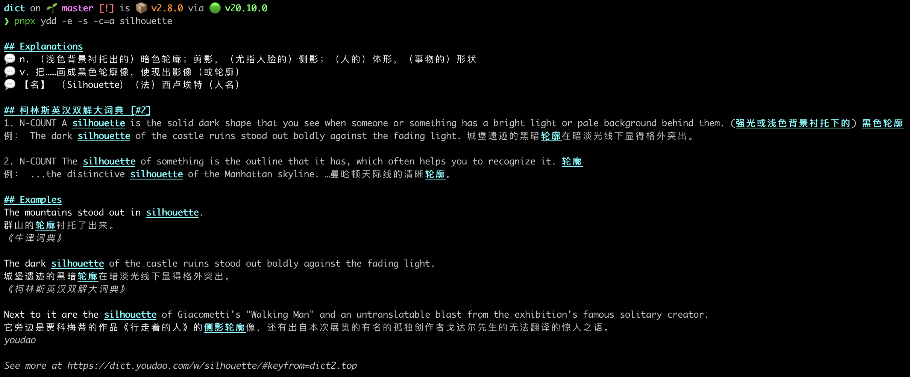

<h1 align="center">YDD</h1>



[中文](./README.md) | English

> `Y`ou`D`ao `D`ictionary

Explain English word in Chinese.

A **Beautiful and Elegant** Dictionary for Programmers Who Prefer Terminals.

## Usage

Query the meaning of "silhouette":

```shell
# Fast 🚀
pnpx ydd silhouette

# Super fast 🚀
bunx ydd silhouette
```

Or show more details with bilingual `e`xamples and `s`peak it out:

```shell
pnpx ydd vite -e -s
```

stream the output word by word like an LLM by default, use `--no-stream` to disable it:

```shell
pnpx ydd wonderful --no-stream
```

## Features

- **Full-fledged**: **Look up** individual words, **translate** full passages, and handle **Chinese-to-English**. All in one place.
- **Fast**: Querying the meaning of a word is very fast about a few hundred milliseconds.
- **Beautiful**: The output is very beautiful.
- **Elegant**: No dependencies, no configuration.
- **Bilingual**: Show collins bilingual examples.
- **Speak**: Speak the word out. `pnpx ydd vite --speak` (Macos only).
- **Stream**: `--stream` flag for word-by-word output, like LLM token streaming.

## Tech Features

- **Light weight**: Zero dependencies.
- **Built with speed in mind**:
  - It's a CLI but not use commander or inquirer or yargs and chalk! Just native Node.js [`parseArgs`](https://nodejs.org/docs/latest/api/util.html#utilparseargsconfig).
  - No cheerio, node-html-parser or request library. Use Node.js `fetch` to request. And [vm](https://nodejs.org/docs/latest/api/vm.html) to evaluate script and use Robust regular expressions as fallback to parse when failed.
  - Instead of heavy renderer charmbracelet/glow, we use our own lightweight markdown render—yet the output still looks gorgeous.
- **Robust**: Use double source: script, HTML or openapi. Downgrade to `https.request` when `fetch` not supported.
- **Battle-tested**: Unit tests, end-to-end tests, and random tests (Before every release, several words are randomly picked from a pool of 789 then fed into the cases to test the robustness of the program)...

## TODO

- [x] Translate long sentence.

## Show your support ❤️

If YDD saved you a second, please [star ⭐️](https://github.com/legend80s/dict) the repo!
