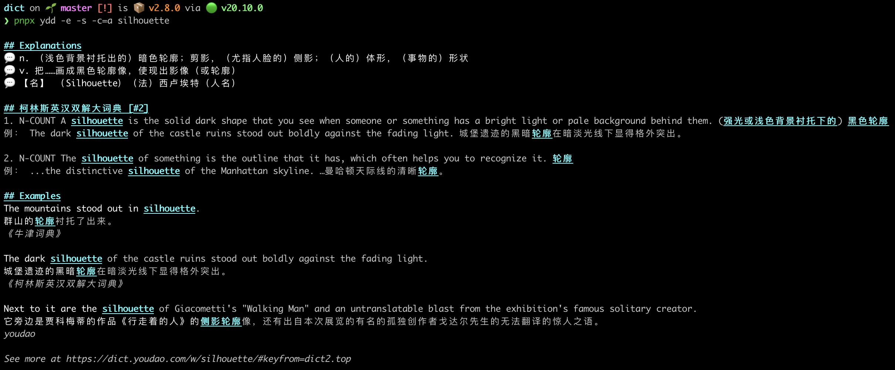

# ydd



> `Y`ou`D`ao `D`ictionary
>
> 专为爱用命令行 🖥️ 的程序员打造的有道词典。
>
> 在终端里查英文单词的中文释义，🦢 优雅快速。无需打开浏览器输入单词点击查询等待返回，无广告更清爽更便捷。

## 用法

查询 silhouette 的含义：

```shell
# 飞快 🚀
pnpx ydd silhouette

# 极速 🚀
bunx ydd silhouette
```

### 用法一：仅查询释义

```markdown
❯ pnpx ydd silhouette


🟢  n. （浅色背景衬托出的）暗色轮廓；剪影，（尤指人脸的）侧影；（人的）体形，（事物的）形状
🟢  v. 把……画成黑色轮廓像，使现出影像（或轮廓）
🟢  【名】 （Silhouette）（法）西卢埃特（人名）

*See more at https://dict.youdao.com/result?word=silhouette&lang=en*
*查询单词耗时 🕑: 322.812ms*
```

### 用法二：查询释义加 Collins 和双语例句

```markdown
❯ pnpx ydd silhouette -collins=all --example


## Explanations 💡
🟢  n. （浅色背景衬托出的）暗色轮廓；剪影，（尤指人脸的）侧影；（人的）体形，（事物的）形状
🟢  v. 把……画成黑色轮廓像，使现出影像（或轮廓）
🟢  【名】 （Silhouette）（法）西卢埃特（人名）

## 柯林斯英汉双解大词典 [#2] 📖
1. [N-COUNT 可数名词] A **silhouette** is the solid dark shape that you see when someone or something has a bright light or pale background behind them. (强光或浅色背景衬托下的) 黑色
轮廓
├── The dark **silhouette** of the castle ruins stood out boldly against the fading light.
└── 城堡遗迹的黑暗**轮廓**在暗淡光线下显得格外突出。

2. [N-COUNT 可数名词] The **silhouette** of something is the outline that it has, which often helps you to recognize it. 轮廓
├── ...the distinctive **silhouette** of the Manhattan skyline.
└── …曼哈顿天际线的清晰**轮廓**。

## Examples ⭐
1. The mountains stood out in **silhouette**.
群山的**轮廓**衬托了出来。
《牛津词典》

2. The dark **silhouette** of the castle ruins stood out boldly against the fading light.
城堡遗迹的黑暗**轮廓**在暗淡光线下显得格外突出。
《柯林斯英汉双解大词典》

3. Next to it are the **silhouette** of Giacometti's "Walking Man" and an untranslatable blast from the exhibition's famous solitary creator.
它旁边是贾科梅蒂的作品《行走着的人》的**侧影轮廓**像，还有出自本次展览的有名的孤独创作者戈达尔先生的无法翻译的惊人之语。

*See more at https://dict.youdao.com/result?word=silhouette&lang=en*
*查询单词耗时 🕑: 365.235ms*
```

**想查询释义并朗读：**

```shell
pnpx ydd silhouette --speak
```

### 用法三：流式输出（默认开启）

默认逐词输出，体验如大语言模型般流畅。可通过 `--no-stream` 关闭：

```shell
pnpx ydd silhouette --no-stream
```

## 特性

- **🦸 全能**：查单词、翻译长句、中译英，一应俱全。
- **🚀 极速**：每次查询仅需几百毫秒，。
- **🎨 美观**：排版优雅，赏心悦目。
- **🎈 轻量**：零依赖，零配置，即装即用。
- **🌍 双语**：内置柯林斯双语例句。
- **🔊 朗读**：支持单词朗读，`pnpx ydd vite --speak`（仅 macOS）。
- **🔄 流式**：默认逐词输出（`--no-stream` 关闭），体验如大语言模型般流畅。

## 技术亮点

- **极小零依赖**：纯原生，无第三方依赖。
  - CLI 却不依赖 commander/inquirer/yargs/chalk，仅用 Node.js 原生 [`parseArgs`](https://nodejs.org/docs/latest/api/util.html#utilparseargsconfig)。
  - 无需 cheerio、node-html-parser、request，用原生 `fetch` 请求；
  - 放弃重量级 glow，自研轻量 Markdown 渲染器，输出依旧惊艳。
- **高可用**：
  - 双路数据源（HTML 源 1 / HTML 源 2 / OpenAPI）。
  - 双查找策略——主策略：
    - 使用沙箱环境中的 `node:vm` 从有道页面 HTML 中提取 `__NUXT__` JSON。备用策略：基于正则表达式的 HTML 解析。这确保了高可用性。
    - 优先用经过安全处理的 `node:vm` 执行脚本，失败则回退至健壮的正则解析。
  - `fetch` 不可用时自动降级到 `https.request`。
- **久经考验**：单元测试、端到端测试，外加随机测试（每次发布前从 789 个单词池中随机抽取若干进行全链路测试验证）。
- **🔄 流式输出**：`Intl.Segmenter` 分词（完美支持中英文分词）模仿 SSE 逐 token 输出，体验如大语言模型。

## 待办

- [x] 长句翻译

## 支持 ❤️

如果它帮到了你，不妨[一键三连 🍻！](https://github.com/legend80s/dict)
也欢迎给颗 ⭐️！

## 开发

```shell
pnpm i
node ./bin.mjs -e -c=a "word"
```

## 自动化测试

```shell
node --test

# 测试某一个文件
node --test test/core.test.translate.mjs

# 测试某一个 case：先将 `test(...)` 改成 `test.only(...)` 然后执行
node --test-only test/core.test.translate.mjs
```

---

English README:

# ydd


> `Y`ou`D`ao `D`ictionary

Explain English word in Chinese.

A **Beautiful and Elegant** Dictionary for Programmers Who Prefer Terminals.

## Usage

Query the meaning of "silhouette":

```shell
# Fast 🚀
pnpx ydd silhouette

# Super fast 🚀
bunx ydd silhouette
```

Or show more details with bilingual `e`xamples and `s`peak it out:

```shell
pnpx ydd vite -e -s
```

stream the output word by word like an LLM by default, use `--no-stream` to disable it:

```shell
pnpx ydd wonderful --no-stream
```

## Features

- **Full-fledged**: **Look up** individual words, **translate** full passages, and handle **Chinese-to-English**. All in one place.
- **Fast**: Querying the meaning of a word is very fast about a few hundred milliseconds.
- **Beautiful**: The output is very beautiful.
- **Elegant**: No dependencies, no configuration.
- **Bilingual**: Show collins bilingual examples.
- **Speak**: Speak the word out. `pnpx ydd vite --speak` (Macos only).
- **Stream**: `--stream` flag for word-by-word output, like LLM token streaming.

## Tech Features

- **Light weight**: Zero dependencies.
- **Built with speed in mind**:
  - It's a CLI but not use commander or inquirer or yargs and chalk! Just native Node.js [`parseArgs`](https://nodejs.org/docs/latest/api/util.html#utilparseargsconfig).
  - No cheerio, node-html-parser or request library. Use Node.js `fetch` to request. And [vm](https://nodejs.org/docs/latest/api/vm.html) to evaluate script and use Robust regular expressions as fallback to parse when failed.
  - Instead of heavy renderer charmbracelet/glow, we use our own lightweight markdown render—yet the output still looks gorgeous.
- **Robust**: Use double source: script, HTML or openapi. Downgrade to `https.request` when `fetch` not supported.
- **Battle-tested**: Unit tests, end-to-end tests, and random tests (Before every release, several words are randomly picked from a pool of 789 then fed into the cases to test the robustness of the program)...

## TODO

- [x] Translate long sentence.

## Show your support ❤️

If YDD saved you a second, please [star ⭐️](https://github.com/legend80s/dict) the repo!

## Development

```shell
pnpm i
node ./bin.mjs -e -c=a "word"
```
